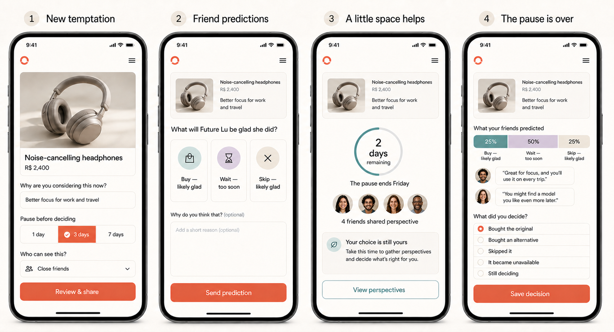
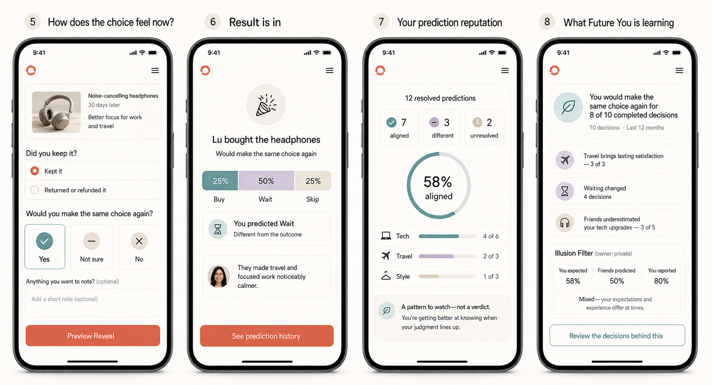

# Closed-loop screen concepts

## Current Entrega 1 specifications

For the approved first delivery, agents must use these implementation-oriented
documents before the broader closed-loop concept boards below:

- [Shared design-system contract](e1-design-system-contract.md) — canonical
  tokens, `Bib*` component contracts, Material 3/MUI mapping, fixtures, and
  cross-agent handoff rules.
- [11-screen agent prompts](e1-11-screen-agent-prompts.md) — master prompt,
  common foundation task, screen-specific tasks, copy, states, accessibility,
  sequencing, and adversarial review gates.
- [Flutter handoff from the local Figma Make export](e1-flutter-handoff.md) —
  source precedence, reusable visual anatomy, screen-by-screen mobile mapping,
  implementation sequence, and planned validation for the creator flow.

The concept boards in this directory cover later closed-loop stages and may
contain elements that are explicitly outside Entrega 1. The mini-PRD and
Decision Log take precedence.

These high-fidelity concept boards translate the approved Before I Buy experience into eight primary mobile pages.

They are product-direction artifacts, not implementation-ready specifications. Exact layout, interaction states, accessibility behavior, Portuguese localization, and component tokens still require design-system work and usability testing.

## Decision phase

| Stage | Page | Primary emotional job | Main interaction |
|---:|---|---|---|
| 1 | Temptation | Move desire into a calmer, structured space | Capture item, reason, pause, and audience |
| 2 | Friend predictions | Invite useful perspective without anchoring | Predict Buy, Wait, or Skip and optionally explain |
| 3 | Pause | Preserve agency while anticipation builds | Review perspectives without urgency |
| 4 | Decision update | Let the owner record the real choice | Original, alternative, skipped, unavailable, or still deciding |

## Reflection and learning phase

| Stage | Page | Primary emotional job | Main interaction |
|---:|---|---|---|
| 5 | Later reflection | Compare expectation with lived experience | Record kept/returned and same-choice-again outcome |
| 6 | Reveal | Close the social loop without declaring winners and losers | See decision, reflection, group prediction, and personal alignment |
| 7 | Prediction reputation | Build private mastery and social identity | Review resolved, aligned, different, and unresolved predictions |
| 8 | Personal insight | Turn completed decisions into self-knowledge | Inspect sample-based patterns and underlying decisions |

## Visual direction represented

- warm neutral surfaces with one coral action accent;
- muted teal, lavender, and sand for neutral semantic distinction;
- product imagery and friend context remain primary;
- restrained cards, motion implications, and celebration;
- no finance-dashboard, courtroom, casino, or red-versus-green aesthetic;
- no follower count, global leaderboard, money-saved claim, or public rank;
- accessible contrast and touch-friendly controls as design intent;
- uncertainty, unresolved outcomes, and small samples use neutral language.

## Product decisions demonstrated

- the owner chooses 1 day, 3 days, or 7 days, with 3 days suggested;
- results stay hidden from a participant until their prediction is submitted;
- the pause communicates calm, not artificial scarcity;
- the owner remains the final authority;
- reflection distinguishes kept from returned/refunded;
- Reveal uses **Aligned** and **Different from the outcome**, not winner and loser;
- reputation is private and sample-based;
- personal insight exposes sample size and includes the owner-private Illusion Filter.

## Next design work

1. Separate the eight boards into editable component-based screens.
2. Create Portuguese-first copy variants and test label length.
3. Define design tokens, component states, typography, spacing, and iconography.
4. Design loading, offline, empty, overdue, revoked, private, blocked, and error states.
5. Test large text, screen-reader order, contrast, reduced motion, and 44×44 minimum targets.
6. Prototype the transitions from voting to pause, decision to reflection, and Reveal to insight.
7. Validate emotional tone with the intended adult Brazilian audience.

The exact generation briefs are preserved in [Generation prompts](generation-prompts.md).
